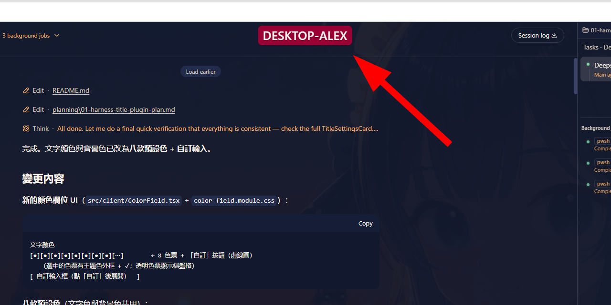
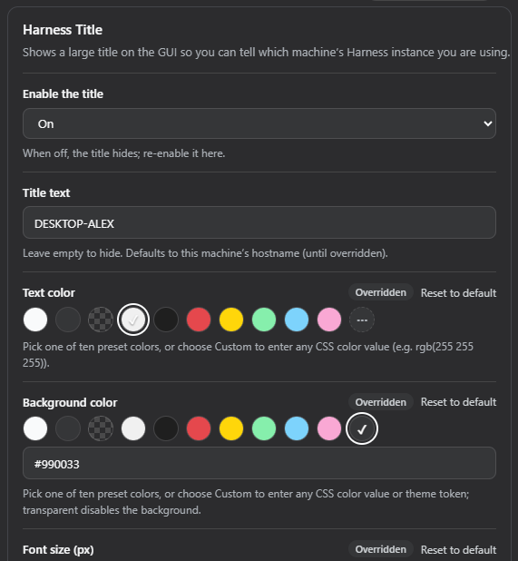

# Harness Title（DSH 插件）

在 DeepSeek Harness（DSH）Web GUI 顯示**大字、可設色、可設背景色**的自訂 Name Title，
用來一眼識別「目前正在使用哪一台機器的 Harness」。

預設顯示在 **New Session 按鈕正上方**（左側 sidebar 頂部），開箱即顯示本機 hostname
（由 Host 端注入 base value），可在 **Settings 設定頁** 修改文字、文字顏色、背景色、
字體大小（10–72px）、顯示位置，並持久化到 `~/.dsh/settings.yaml`（每台機器各自一份）。

## 效果預覽





> 截圖後請放入 `assets/` 資料夾，檔名對應上述兩張圖即可自動顯示。

## 功能

- 四種顯示位置：New Session 按鈕上方（預設）／右上角／左上角／頂部居中
- 文字顏色、背景色支援任意 CSS 色值（含 `var(--dsw-*)` 主題變數）
- 字體大小 10–72px
- 總開關（關閉即隱藏）
- 設定即時生效（儲存後 badge 立即更新，無需重新整理）
- 不阻擋任何 UI 操作（badge `pointer-events: none`）
- 側欄收起成 rail 時，「New Session 按鈕上方」位置自動隱藏
- 中英雙語（zh / en）
- 多機器各自設定：settings.yaml 為每 profile／每機器一份

## 安裝

```bash
# 在 profile 目錄（~/.dsh/profiles/web）執行
dsh plugin --profile web add link:C:/Users/AlexTam/Projects/ai/deepseek-harness/Plugin/harness-title
```

> 安裝後需**重啟 dsh web 進程**（Host 端 cordis 載入）並在瀏覽器硬刷新。
> 若 pnpm 報 `ERR_PNPM_UNEXPECTED_STORE`，請先設定完整環境變數
> （`USERPROFILE` / `LOCALAPPDATA` / `APPDATA` / `HOME`）再執行。

驗證：

```bash
dsh plugin --profile web list          # 應出現 harness-title
# ~/.dsh/profiles/web/node_modules/harness-title 應存在
# 瀏覽器載入 http://127.0.0.1:3080/plugins/harness-title/client.js 應回傳 bundle
```

## 設定

Settings 側欄 → **Harness 標題** 頁：

| 欄位 | 說明 | 預設 |
|---|---|---|
| 啟用標題 | 總開關 | 開 |
| 標題文字 | 留空隱藏；未覆寫時為 hostname | 本機 hostname |
| 文字顏色 | 十款預設色 + 「自訂」輸入任意 CSS 色值 | `#f0f0f0` |
| 背景色 | 十款預設色 + 「自訂」輸入任意 CSS 色值或主題變數 | `var(--dsw-alias-bg-layer-3)` |
| 字體大小（px） | 10–72 | 22 |
| 顯示位置 | 四選一 | New Session 按鈕上方 |

十款預設色：主題文字色、主題底色、透明、近白、近黑、紅、黃、淺綠、淺藍、粉紅。

也可直接編輯 `~/.dsh/settings.yaml`：

```yaml
harness-title:
  enabled: true
  text: '我的機器'
  color: '#f0f0f0'
  backgroundColor: 'rgba(0, 0, 0, 0.45)'
  fontSize: 28
  position: top-right   # above-new-session | top-right | top-left | top-center
```

## 開發

```bash
pnpm install          # 安裝建置依賴
pnpm build            # tsc -b && tsdown → lib/index.js + lib/client.js
pnpm watch            # tsdown --watch（Client 端變更）
```

- Client 端變更：重建後**瀏覽器硬刷新**即可
- Host 端變更（cordis / settings namespace）：需**重啟 dsh web 進程**

移除：

```bash
dsh plugin --profile web remove harness-title
```

## 架構

- Host 端（`src/index.ts`）：僅註冊 `harness-title` settings namespace，
  base entry 帶 `os.hostname()`。
- Client 端（`src/client/`）：
  - `TitleBadge.tsx` 註冊進 `shell.overlay` slot（root list slot，
    覆蓋整個 frame 的浮動層），`position: fixed` 依設定座標顯示；
  - `TitleSettingsCard.tsx` 註冊進 `settings.section` slot（一級設定頁），
    採用 family 共用 `CardForm` staged form 模式（Save 才寫入、revision-fenced）。
- 設定解析層級：schema 預設值 → Host composition base → user 文件（settings.yaml）。

## 已知限制

- `shell.overlay` slot 屬 DSH rc.7 實作，未來版本可能變動；slot 名稱集中為常數，
  升級時易於定位（備案：仿 dsh-pet 直接掛 `document.body`）。
- 「New Session 按鈕上方」位置會覆蓋在 sidebar 字標（wordmark）區域之上；
  若與字標重疊，建議在設定頁指定一個不透明的背景色。
